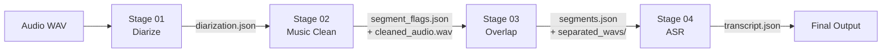

# Tách Pipeline thành các Stage Độc Lập

## Mục tiêu
Tạo folder `podcast-pipeline/stages/` chứa 4 file Python độc lập + shared utilities + 4 file Jupyter notebook tương ứng. **Không sửa bất kỳ file hiện có nào** — chỉ tạo file mới.

## Cấu trúc folder mới

```
podcast-pipeline/stages/
├── stage_common.py          # Copy từ stage_common.py gốc
├── stage_01_diarize.py      # Diarization (Sortformer + VAD + Speaker Linking)
├── stage_02_music_clean.py  # Music detection + Demucs removal
├── stage_03_overlap.py      # Overlap separation (SepReformer_Base_WSJ0)
├── stage_04_asr.py          # ASR MoE (Whisper + PhoWhisper + Chunkformer)
├── config.json              # Copy config.json gốc
├── models/                  # Copy nguyên từ models/
│   ├── silero_vad.py
│   ├── whisper_asr.py
│   └── vietnamese_asr.py
├── utils/                   # Copy nguyên từ utils/
│   ├── asr_quality.py
│   └── tool.py
└── notebooks/
    ├── nb_stage_01_diarize.ipynb
    ├── nb_stage_02_music_clean.ipynb
    ├── nb_stage_03_overlap.ipynb
    └── nb_stage_04_asr.ipynb
```

---

## Dữ liệu truyền giữa các Stage

Mỗi stage đọc JSON đầu vào từ stage trước, xử lý, rồi ghi JSON đầu ra cho stage sau. Trên Kaggle hỗ trợ cả 2 cách: ZIP download/upload hoặc Kaggle Dataset dependency.



---

## Proposed Changes

### Shared Files (Copy nguyên)

#### [NEW] `stages/stage_common.py`
Copy nguyên từ [stage_common.py](file:///Users/lam/Library/CloudStorage/GoogleDrive-he180931@gmail.com/Drive%20cu%CC%89a%20to%CC%82i/AI%20thu%CC%9B%CC%A3c%20chie%CC%82%CC%81n/tts/sommelier/podcast-pipeline/stage_common.py) gốc (318 dòng).

#### [NEW] `stages/models/` — Copy nguyên 3 file
- [silero_vad.py](file:///Users/lam/Library/CloudStorage/GoogleDrive-he180931@gmail.com/Drive%20cu%CC%89a%20to%CC%82i/AI%20thu%CC%9B%CC%A3c%20chie%CC%82%CC%81n/tts/sommelier/podcast-pipeline/models/silero_vad.py) → `stages/models/silero_vad.py`
- [whisper_asr.py](file:///Users/lam/Library/CloudStorage/GoogleDrive-he180931@gmail.com/Drive%20cu%CC%89a%20to%CC%82i/AI%20thu%CC%9B%CC%A3c%20chie%CC%82%CC%81n/tts/sommelier/podcast-pipeline/models/whisper_asr.py) → `stages/models/whisper_asr.py`
- [vietnamese_asr.py](file:///Users/lam/Library/CloudStorage/GoogleDrive-he180931@gmail.com/Drive%20cu%CC%89a%20to%CC%82i/AI%20thu%CC%9B%CC%A3c%20chie%CC%82%CC%81n/tts/sommelier/podcast-pipeline/models/vietnamese_asr.py) → `stages/models/vietnamese_asr.py`

#### [NEW] `stages/utils/` — Copy nguyên 2 file
- [asr_quality.py](file:///Users/lam/Library/CloudStorage/GoogleDrive-he180931@gmail.com/Drive%20cu%CC%89a%20to%CC%82i/AI%20thu%CC%9B%CC%A3c%20chie%CC%82%CC%81n/tts/sommelier/podcast-pipeline/utils/asr_quality.py) → `stages/utils/asr_quality.py`
- [tool.py](file:///Users/lam/Library/CloudStorage/GoogleDrive-he180931@gmail.com/Drive%20cu%CC%89a%20to%CC%82i/AI%20thu%CC%9B%CC%A3c%20chie%CC%82%CC%81n/tts/sommelier/podcast-pipeline/utils/tool.py) → `stages/utils/tool.py`

#### [NEW] `stages/config.json`
Copy nguyên từ [config.json](file:///Users/lam/Library/CloudStorage/GoogleDrive-he180931@gmail.com/Drive%20cu%CC%89a%20to%CC%82i/AI%20thu%CC%9B%CC%A3c%20chie%CC%82%CC%81n/tts/sommelier/podcast-pipeline/config.json) gốc.

---

### Stage 01: Diarization

#### [NEW] `stages/stage_01_diarize.py`
Copy và gộp code từ [stage_01_diarize.py](file:///Users/lam/Library/CloudStorage/GoogleDrive-he180931@gmail.com/Drive%20cu%CC%89a%20to%CC%82i/AI%20thu%CC%9B%CC%A3c%20chie%CC%82%CC%81n/tts/sommelier/podcast-pipeline/stage_01_diarize.py) wrapper + các hàm sau từ [main_original_ASR_MoE.py](file:///Users/lam/Library/CloudStorage/GoogleDrive-he180931@gmail.com/Drive%20cu%CC%89a%20to%CC%82i/AI%20thu%CC%9B%CC%A3c%20chie%CC%82%CC%81n/tts/sommelier/podcast-pipeline/main_original_ASR_MoE.py):

| Hàm/Class cần copy | Dòng trong main | Chức năng |
|---|---|---|
| `_apply_sortformer_segment_padding_from_args` | L108-144 | Pad start/end segments |
| `custom_binarize` | L2133-2179 | Binarize prob tensor với onset/offset |
| `sortformer_dia` | L2181-2221 | Parse Sortformer output → DataFrame |
| `df_to_list` | L2223-2240 | DataFrame → list dicts |
| `split_long_segments` | L2260-2306 | Cắt segment quá dài |
| `_build_silence_intervals` | L2309-2355 | Tìm khoảng im lặng bằng VAD |
| `_build_chunk_ranges` | L2358-2419 | Chia thời gian thành chunks |
| `_extract_speaker_embedding` | L2422-2483 | Trích xuất embedding speaker |
| `_cosine_similarity` | L2486-2493 | Cosine similarity |
| `_compute_chunk_speaker_centroids` | L2496-2519 | Tính centroid cho speaker |
| `align_speakers_across_chunks` | L2522-2592 | Liên kết speaker giữa các chunk |
| `re_cluster_speakers` | L2595-2718 | Gộp speaker bị phân mảnh |
| `prepare_diarization_chunks` | L2721-2797 | Chuẩn bị chunk audio cho diarization |
| Constants | L148-156 | `MAX_DIA_CHUNK_DURATION`, `MIN_SPLIT_SILENCE`... |

**Tham số binarize mặc định:**
- `onset=0.53`, `offset=0.49`, `pad_onset=0.23`, `pad_offset=0.01`
- `min_duration_on=0.42`, `min_duration_off=0.34`

**Thư viện cần:** `torch`, `nemo_toolkit[asr]`, `pyannote.audio`, `librosa`, `numpy`, `pandas`, `pydub`, `soundfile`

**Đầu vào:** File audio WAV
**Đầu ra:** `diarization.json`

---

### Stage 02: Music Clean

#### [NEW] `stages/stage_02_music_clean.py`
Copy từ [stage_02_music_clean.py](file:///Users/lam/Library/CloudStorage/GoogleDrive-he180931@gmail.com/Drive%20cu%CC%89a%20to%CC%82i/AI%20thu%CC%9B%CC%A3c%20chie%CC%82%CC%81n/tts/sommelier/podcast-pipeline/stage_02_music_clean.py) wrapper + các hàm từ main:

| Hàm cần copy | Dòng trong main | Chức năng |
|---|---|---|
| `detect_segment_background_music` | L699-741 | Dùng PANNs phát hiện nhạc nền |
| `separate_full_vocals_demucs` | L744-794 | Gọi Demucs tách vocal |
| `remove_segment_background_music_demucs` | L797-881 | Xóa nhạc nền từng segment |
| `preprocess_segments_with_demucs` | L885-982 | Orchestrator chạy cả pipeline music clean |

**Thư viện cần:** `torch`, `panns_inference`, `demucs` (subprocess), `pydub`, `numpy`, `librosa`, `soundfile`

**Đầu vào:** `diarization.json` (từ Stage 01) + audio WAV gốc
**Đầu ra:** `segment_flags.json` + `cleaned_audio.wav`

---

### Stage 03: Overlap Separation

#### [NEW] `stages/stage_03_overlap.py`
Copy từ [stage_03_overlap_separate.py](file:///Users/lam/Library/CloudStorage/GoogleDrive-he180931@gmail.com/Drive%20cu%CC%89a%20to%CC%82i/AI%20thu%CC%9B%CC%A3c%20chie%CC%82%CC%81n/tts/sommelier/podcast-pipeline/stage_03_overlap_separate.py) wrapper + các hàm từ main:

| Hàm/Class cần copy | Dòng trong main | Chức năng |
|---|---|---|
| `detect_overlapping_segments` | L1097-1141 | Tìm đoạn nói đè nhau |
| `SepReformerSeparator` | L1144-1283 | Load + chạy model SepReformer (8kHz) |
| `identify_speaker_with_embedding` | L1286-1348 | Nhận diện speaker sau khi tách |
| `process_overlapping_segments_with_separation` | L1352-1559 | Orchestrator tách giọng đè |

**Thư viện cần:** `torch`, `pyannote.audio`, `librosa`, `numpy`, `yaml`, `soundfile`

**Đầu vào:** `segment_flags.json` + `cleaned_audio.wav` (từ Stage 02)
**Đầu ra:** `segments.json` + `separated_segments/` (WAV files)

---

### Stage 04: ASR

#### [NEW] `stages/stage_04_asr.py`
Copy từ [stage_04_asr.py](file:///Users/lam/Library/CloudStorage/GoogleDrive-he180931@gmail.com/Drive%20cu%CC%89a%20to%CC%82i/AI%20thu%CC%9B%CC%A3c%20chie%CC%82%CC%81n/tts/sommelier/podcast-pipeline/stage_04_asr.py) wrapper + các hàm/class từ main:

| Hàm/Class cần copy | Dòng trong main | Chức năng |
|---|---|---|
| `RoverEnsembler` | L158-400 | ROVER voting ensemble cho multi-ASR |
| `RepetitionFilter` | L403-457 | Lọc n-gram lặp |
| `asr` | L1563-1678 | ASR đơn (Whisper) |
| `asr_MoE` | L1683-1888 | ASR MoE (3 model + ROVER) |

**Thư viện cần:** `torch`, `faster-whisper`, `transformers`, `librosa`, `numpy`, `concurrent.futures`

**Đầu vào:** `segments.json` (từ Stage 03) + `cleaned_audio.wav`
**Đầu ra:** `transcript.json`

---

### Kaggle Notebooks

Mỗi notebook có cấu trúc chuẩn 6 cells:

```
Cell 1: Git clone repo + checkout branch
Cell 2: pip install (chỉ thư viện cần cho stage đó)
Cell 3: Upload/load input data (hỗ trợ cả ZIP upload và Kaggle Dataset)
Cell 4: Chạy stage script
Cell 5: Review kết quả (log + bảng segment)
Cell 6: Nén ZIP output + FileLink tải về
```

#### [NEW] `stages/notebooks/nb_stage_01_diarize.ipynb`
- Cài: `nemo_toolkit[asr]`, `pyannote.audio`
- Input: Audio WAV (từ Kaggle Dataset)
- Output: ZIP chứa `diarization.json`

#### [NEW] `stages/notebooks/nb_stage_02_music_clean.ipynb`
- Cài: `demucs`, `panns_inference`
- Input: `diarization.json` + Audio WAV
- Output: ZIP chứa `segment_flags.json` + `cleaned_audio.wav`

#### [NEW] `stages/notebooks/nb_stage_03_overlap.ipynb`
- Cài: `pyannote.audio`, SepReformer repo (git clone)
- Input: `segment_flags.json` + `cleaned_audio.wav`
- Output: ZIP chứa `segments.json` + `separated_segments/`

#### [NEW] `stages/notebooks/nb_stage_04_asr.ipynb`
- Cài: `faster-whisper`, `transformers`
- Input: `segments.json` + `cleaned_audio.wav`
- Output: ZIP chứa `transcript.json`

---

## Verification Plan

### Automated Tests
1. Kiểm tra mỗi file stage mới có thể chạy `python stages/stage_XX.py --help` mà không lỗi import.
2. So sánh output JSON format giữa stage mới và stage cũ (cùng input) để đảm bảo tương thích.

### Manual Verification
- Chạy thử trên Kaggle từng notebook một với file audio test.
- So sánh kết quả diarization/ASR giữa pipeline cũ (V5) và pipeline mới.
